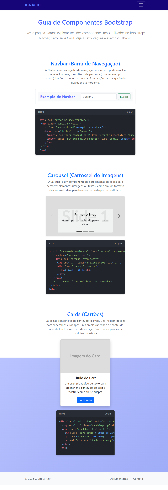

# 🚀 Guia de Componentes Bootstrap - Ignácio

<p align="center">
  
</p>

## 💻 Sobre o Projeto

O **Guia de Componentes Bootstrap** é uma página educacional e interativa projetada para demonstrar a implementação prática de elementos essenciais do framework Bootstrap 5. O projeto foca em fornecer exemplos reais, explicações teóricas e blocos de código prontos para copiar, facilitando o aprendizado de desenvolvedores iniciantes.

Este projeto foi desenvolvido como parte do currículo do curso **Técnico em Desenvolvimento de Sistemas** da Escola **SENAI A. Jacob Lafer**.

---

## ⚙️ Funcionalidades e Conceitos Aplicados

Durante o desenvolvimento, foram aplicados os seguintes conceitos técnicos:

-   **HTML5 & Acessibilidade:** Uso de hierarquia correta de títulos (`h1`, `h2`, `h3`) para garantir a leitura por tecnologias assistivas e conformidade com os padrões de validação.
-   **Bootstrap 5 Framework:** -   **Grid System:** Uso de containers, rows e columns para layouts responsivos.
    -   **Componentes:** Implementação de `Navbar` dinâmica, `Carousel` com transições e `Cards` estilizados.
    -   **Utilities:** Aplicação de classes auxiliares de espaçamento e tipografia.
-   **CSS Customizado:** Interface com gradiente linear fixo e estilização de um contêiner de código com *syntax highlighting* simulado.
-   **JavaScript & Clipboard API:** Implementação de funcionalidade para copiar trechos de código com feedback visual em tempo real.

---

## 🛠 Tecnologias Utilizadas

As seguintes ferramentas foram usadas na construção do projeto:

-    **HTML5**
-    **CSS3**
-    **Bootstrap 5**
-    **JavaScript**
-    **Git**

---

## 📂 Estrutura de Pastas

```bash
Guia-Bootstrap/
├── index.html       # Estrutura principal e lógica do projeto
├── README.md        # Documentação completa
└── (assets/)        # Pasta para recursos visuais locais